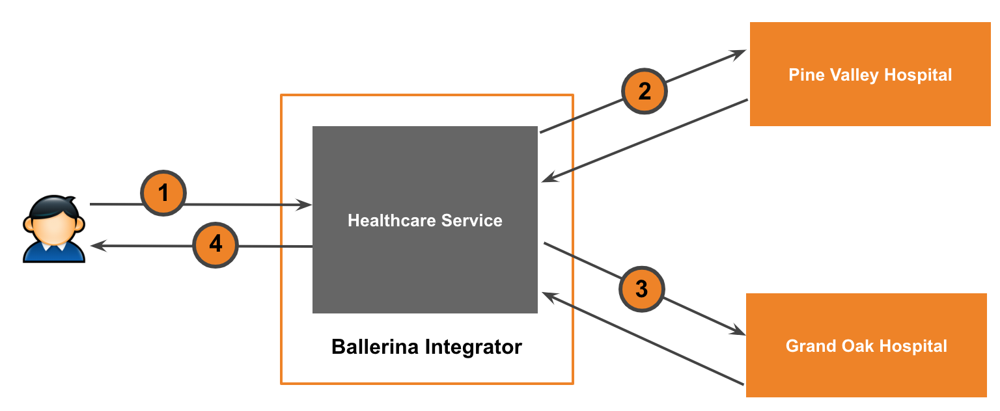
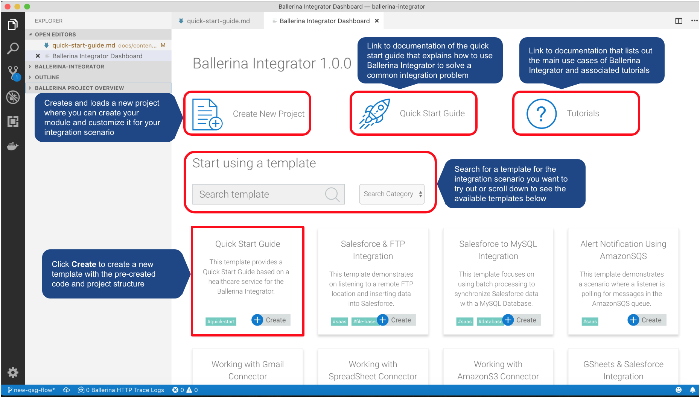

# Quick Start Guide

Let's get started with WSO2 Ballerina Integrator by running an integration use case in your local environment. This is a simple service orchestration scenario. The scenario is about a basic healthcare system where Ballerina Integrator is used to integrate two backend hospital services to provide information to the client.

Most healthcare centers have a system that is used to make doctor appointments. To check the availability of the doctors for a particular time, users need to visit the hospitals or use each and every online system that is dedicated for a particular healthcare center. Here we are making it easier for patients by orchestrating those isolated systems for each healthcare provider and exposing a single interface to the users.



In the above scenario, the following takes place:

1. The client makes a call to the Healthcare service created using Ballerina Integrator.

2. The Healthcare service calls the Pine Valley Hospital backend service and gets the queried information.

3. The Healthcare service calls the Grand Oak Hospital backend service and gets the queried information.

4. The response is returned to the client with the required information.

Both Grand Oak Hospital and Pine Valley Hospital have services exposed over HTTP protocol.

Pine Valley Hospital service accepts a POST request in following service endpoint URL.

```bash
http://<HOST_NAME>:<PORT>/pineValley/doctors
```

The expected payload should be in the following JSON format.

```json
{
    "doctorType": "<DOCTOR_TYPE>"
}
```

Grand Oak Hospital service accepts a GET request in following service endpoint URL.

```bash
http://<HOST_NAME>:<PORT>/grandOak/doctors/<DOCTOR_TYPE>
```

Let’s implement a simple service that can be used to query the availability of doctors for a particular category from all the available healthcare centers.

<!-- INCLUDE_MD: ../tutorial-prerequisites.md -->
* Download [curl](https://curl.haxx.se/) or a similar tool that can call an endpoint.

Once you have installed the VS Code extension, you could press `Command + Shift + P` in Mac or `Ctrl + Shift + P` in Windows/Linux and search for the command `Ballerina Integrator: Dashboard` to find the Ballerina Integrator dashboard shown below. Please refer the extension's [home page](https://marketplace.visualstudio.com/items?itemName=WSO2.ballerina-integrator) for more details on how to use the provided features.



## Create a Project, Add a Template, and Invoke the Service

Let's create a project using the Ballerina Integrator dashboard. To do this, click **Create** under the Quick Start Guide template. 

A module is a directory that contains Ballerina source code files.

A new window will appear at the top of your screen where you can specify the name of your module.


Once you specify the name of the module, you need to choose if your project is a new project or an existing project. In this case you would choose **New Project**.


Once this is done, specify the name of your project in the window that appears and choose the location of your project in your local machine.


> **Note:** Alternatively, you could use the command line to create your project and add the `healthcare_service` module.

<details>
    <summary>Click here to create a project and add a pre-defined template using the command line instead.</summary>
Create a new project by navigating to a directory of your choice and running the following command. 

<code>ballerina new quick-start-guide</code>

You see a response confirming that your project is created.

Let's use a predefined module from Ballerina Central, which is a public directory that allows you to host templates and modules. 

A template is a predefined code that solves a particular integration scenario. 

In this case, we use the <code>healthcare_service</code> module. Run the following command to pull this module from Ballerina Central.

<code>ballerina pull wso2/healthcare_service</code>

Now navigate into the project directory you created.

<code>cd quick-start-guide</code>

The following command enables you to apply a predefined template you pulled.

<code>ballerina add -t wso2/healthcare_service healthcare_service</code>

This automatically creates a healthcare service for you inside an <code>src</code> directory. 

</details>

A Ballerina service represents a collection of network accessible entry points in Ballerina. A resource within a service represents one such entry point. The generated sample service exposes a network entry point on port 9090.

From the command line, navigate to the `src` directory.

```bash
cd <project-and-module-location>/src
```

Build the service using the `ballerina build` command.

```bash
ballerina build -a
```

> **Tip**: The `-a` command builds all modules in the project.

You get the following output.

```bash
Compiling source
	wso2/healthcare_service:0.1.0

Creating balos
	target/balo/healthcare_service-2019r3-any-0.1.0.balo

Running tests
    wso2/healthcare_service:0.1.0
	No tests found


Generating executables
	target/bin/healthcare_service.jar
```

Run the following Java command to run the executable .jar file that is created once you build your module.

```bash
java -jar target/bin/healthcare_service.jar
```

Your service is now up and running. You can invoke the service using an HTTP client. In this case, we use cURL.

> **Tip**: If you do not have cURL installed, you can download it from [https://curl.haxx.se/download.html](https://curl.haxx.se/download.html).

```bash
curl http://localhost:9090/healthcare/doctor/physician
```

You get the following response.

```json
[
   {
      "name":"Shane Martin",
      "time":"07:30 AM",
      "hospital":"Grand Oak"
   },
   {
      "name":"Geln Ivan",
      "time":"08:30 AM",
      "hospital":"Grand Oak"
   },
   {
      "name":"Geln Ivan",
      "time":"05:30 PM",
      "hospital":"pineValley"
   },
   {
      "name":"Daniel Lewis",
      "time":"05:30 PM",
      "hospital":"pineValley"
   }
]
```

You just started Ballerina Integrator, created a project, started a service, invoked the service you created, and received a response.

To have a look at the code, navigate to the `hospital_service.bal` file found inside your module.
<details>
    <summary>Ballerina code</summary>

```ballerina
import ballerina/http;
import ballerina/log;

http:Client grandOakHospital = new("http://localhost:9091/grandOak");
http:Client pineValleyHospital = new("http://localhost:9092/pineValley");

@http:ServiceConfig {
    basePath: "/healthcare"
}
service healthcare on new http:Listener(9090) {

    @http:ResourceConfig {
        path: "/doctor/{doctorType}"
    }
    resource function getDoctors(http:Caller caller, http:Request request, string doctorType) returns error? {
        json grandOakDoctors = {};
        json pineValleyDoctors = {};
        var grandOakResponse = grandOakHospital->get("/doctors/" + doctorType);
        var pineValleyResponse = pineValleyHospital->post("/doctors", {doctorType: doctorType});
        // Extract doctors array from grand oak hospital response
        if (grandOakResponse is http:Response) {
            json result = check grandOakResponse.getJsonPayload();
            grandOakDoctors = check result.doctors.doctor;
        } else {
            handleError(caller, <@untained> grandOakResponse.reason());
        }
        // Extract doctors array from pine valley hospital response
        if (pineValleyResponse is http:Response) {
            json result = check pineValleyResponse.getJsonPayload();
            pineValleyDoctors = check result.doctors.doctor;
        } else {
            handleError(caller, <@untained> pineValleyResponse.reason());
        }
        // Aggregate grand oak hospital's doctors with pine valley hospital's doctors
        if (grandOakDoctors is json[] && pineValleyDoctors is json[]) {
            foreach var item in pineValleyDoctors {
                grandOakDoctors.push(item);
            }
        }
        // Respond back to the caller with aggregated json response
        http:Response response = new();
        response.setJsonPayload(<@untained> grandOakDoctors);
        var result = caller->respond(response);

        if (result is error) {
            log:printError("Error sending response", err = result);
        }
    }
}

function handleError(http:Caller caller, string errorMsg) {
    http:Response response = new;

    json responsePayload = {
        "error": {
            "message": errorMsg
        }
    };
    response.setJsonPayload(responsePayload, "application/json");
    var result = caller->respond(response);
    if (result is error) {
        log:printError("Error sending response", err = result);
    }
}
```
</details>

---

## What's Next

- Try out the tutorials available in the [Learn section of our documentation](../../learn/use-cases/).
- You can easily deploy the projects you create by following our documentation on [Docker](../../develop/deploy-on-docker/) and [Kubernetes](../../develop/deploy-on-kubernetes/). Alternately, you can [run this on a JVM](../../develop/running-on-jvm/)
