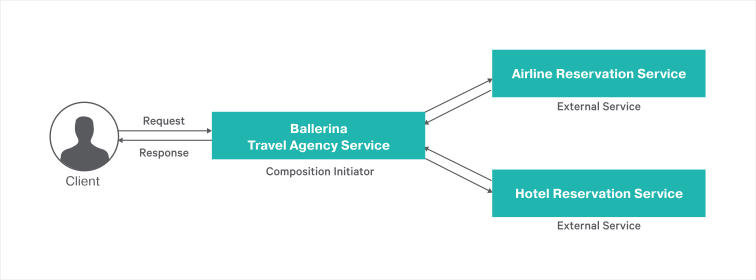

Guide on Service Composition using Ballerina.

# Guide Overview

## About

Ballerina is an open-source programming language that empowers developers to integrate their system easily with the support of connectors. In this guide, we are focusing on aggregating services collectively composed to automate a particular task or business process. You can find other integration modules from the [wso2-ballerina](https://github.com/wso2-ballerina) GitHub repository.

This guide walks you through the process of implementing a service composition using Ballerina language.

## What you’ll build

To understand how you can build a service composition using Ballerina, let's consider a real-world use case of a Travel agency that arranges complete tours for users. A tour package includes airline ticket reservation and hotel room reservation. Therefore, the Travel agency service requires communicating with other necessary back-ends. The following diagram illustrates this use case clearly.



Travel agency is the service that acts as the composition initiator. The other two services are external services that the travel agency service calls to do airline ticket booking and hotel reservation. These are not necessarily Ballerina services and can theoretically be third-party services that the travel agency service calls to get things done. However, for the purposes of setting up this scenario and illustrating it in this guide, these third-party services are also written in Ballerina.

## Implementation

> If you want to skip the basics, you can download the git repo and directly move to the `Testing` section by skipping `Implementation` section.

Create a new project `service-composition`.

```bash
$ ballerina new service-composition
```

Create a module named `service_composition` inside the project directory.

```bash
$ ballerina add service_composition
```

Create the above directories in your local machine and copy the below given `.bal` files to appropriate locations.

### Developing the service

Let's look at the implementation of the travel agency service, which acts as the composition initiator.

Arranging a complete tour travel agency service requires communicating with three other services: airline reservation and hotel reservation. All these services accept POST requests with appropriate JSON payloads and send responses back with JSON payloads. Request and response payloads are similar for all three backend services.

Sample request payload:
```bash
{"Name":"Bob", "ArrivalDate":"12-03-2020", "DepartureDate":"13-04-2022",
 "Preference":<service_dependent_preference>};
```

Sample response payload:

```bash
{"Status":"Success"}
```

When a client initiates a request to arrange a tour, the travel agency service first needs to communicate with the airline reservation service to book a flight ticket. To check the implementation of airline reservation service, see the `airline_reservation_service.bal` implementation.

Once the airline ticket reservation is successful, the travel agency service needs to communicate with the hotel reservation service to reserve hotel rooms. To check the implementation of hotel reservation service, see the `hotel_reservation_service.bal` implementation.

If all services work successfully, the travel agency service confirms and arranges the complete tour for the user. Refer to the `travel_agency_service.bal` to see the complete implementation of the travel agency service. Inline comments are added for better understanding.

The travel agency service communicates with the hotel reservation service to book a room for the client as shown above. The client endpoint defined for this external service call is `hotelReservationEP`.

## Testing

### Starting the service

Once you are done with the development, you can start the services as follows.

- To deploy locally, navigate to `service-composition` directory, and execute the following command.
```bash
$ ballerina build service_composition
```

- This builds a JAR file (.jar) in the target folder. You can run this by using the `java -jar` command.
```bash
$ java -jar target/bin/service_composition.jar
```

- You can see the travel agency service and related backend services are up and running. The successful startup of services will display the following output.
```
[ballerina/http] started HTTP/WS listener 0.0.0.0:9091
[ballerina/http] started HTTP/WS listener 0.0.0.0:9092
[ballerina/http] started HTTP/WS listener 0.0.0.0:9090
```
This starts the `Airline Reservation`, `Hotel Reservation`, and `Travel Agency` services on ports 9091, 9092, and 9090 respectively.

### Invoking the service

Invoke the travel agency service by sending a POST request to arrange a tour.

```bash
$ curl -v -X POST -d '{"Name":"Bob", "ArrivalDate":"12-03-2020",
"DepartureDate":"13-04-2022", "Preference":{"Airline":"Business",
"Accommodation":"Air Conditioned"}}' \
"http://localhost:9090/travel/arrangeTour" -H "Content-Type:application/json"
```

Travel agency service sends a response similar to the following:

```bash
< HTTP/1.1 200 OK
{"Message":"Congratulations! Your journey is ready!!"}
```
