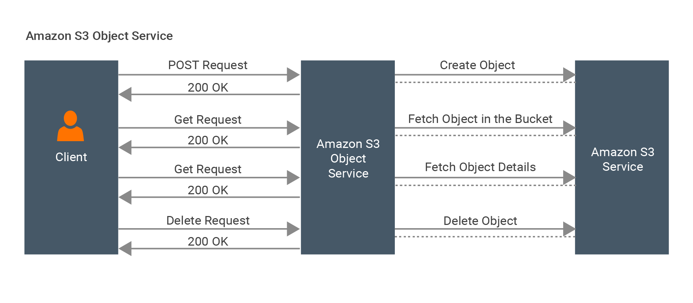

Guide on Amazon S3 Object Service 

# Guide Overview 

## About

Ballerina is an open-source programming language that empowers developers to integrate their system easily with the 
support of connectors. In this guide, we are mainly focusing on connecting to the Amazon Simple Storage Service API to create, store, Githubdownload, and use data with other services.  

The `wso2/amazons3` module allows you to perform the following operations.

This example explains how to use the S3 client to connect with the Amazon S3 instance and to create a Amazon S3 bucket.

You can find other integrations modules from [wso2-ballerina](https://github.com/wso2-ballerina) GitHub organization.

## What you'll build

This application connects with the Amazon S3 API and create a new object in an Amazon S3 bucket, list the available objects in the bucket, display the object content and delete a specified object in the bucket.



## Prerequisites

- [Java](https://www.oracle.com/technetwork/java/index.html)
- Ballerina Integrator
- A Text Editor or an IDE
> **Tip**: For a better development experience, install the Ballerina Integrator extension in [VS Code](https://code.visualstudio.com).
- Link to download Ballerina Integrator.

## Implementation

A Ballerina project is created for the integration use case explained above. Please follow the steps given 
below to create the project and modules. You can learn about the Ballerina project and modules in this 
[guide](https://ei.docs.wso2.com/en/latest/ballerina-integrator/develop/using-modules/#creating-a-project).

#### 1. Create a new project.

```bash
$ ballerina new working-with-object-service
```

#### 2. Create a module.

```bash
$ ballerina add integration-with-amazon-s3-object
```

#### 3. Set up credentials for accessing Amazon S3

- Visit [Amazon S3](https://aws.amazon.com/s3/) and create an Amazon S3 account.

- Create a new access key, which includes a new secret access key.
        - To create a new secret access key for your root account, use the [security credentials](https://console.aws.amazon.com/iam/home?#security_credential) page. Expand the Access Keys section, and then click Create New Root Key.

-  To create a new secret access key for an IAM user, open the [IAM console](https://console.aws.amazon.com/iam/home?region=us-east-1#home). Click **Users** in the **Details** pane, click the appropriate IAM user, and then click **Create Access Key** on the **Security Credentials** tab.
   
- Download the newly created credentials, when prompted to do so in the key creation wizard.

#### 4. Add project configurations file

Add the project configuration file by creating a `ballerina.conf` file under the root path of the project structure. 
This file should have following configurations. Add the obtained SAmazon S3 configurations to the file.

```
ACCESS_KEY_ID="<Amazon S3 key ID>"<br/>
SECRET_ACCESS_KEY="<Amazon S3 secret key>"<br/>
REGION="<Amazon S3 region>"<br/>
BUCKET_NAME="<Amazon S3 bucket name>"<br/>
TRUST_STORE_PATH="<Truststore file location>"<br/>
TRUST_STORE_PASSWORD="<Truststore password>"<br/>
```

#### 5. Write the integration
Open the project with VS Code. The integration implementation is written in the `src/integration-with-amazon-s3-object/main.bal` file.

<!-- INCLUDE_CODE: src/integration-with-amazon-s3-object/main.bal -->

## Testing 

First let’s build the module. Navigate to the project root directory and execute the following command.

```bash
$ ballerina build integration-with-amazon-s3-object
```

This creates the executables. Now run the `integration-with-amazon-s3-object.jar` file created in the above step.

```bash
$ java -jar target/bin/integration-with-amazon-s3-object.jar
```
You will see the following log upon the successful invocation of the service.

```log
[ballerina/http] started HTTP/WS listener 0.0.0.0:9090
```

### Testing the create Object service 

##### (I) JSON Content
Create a file called `content.json` with following JSON content:
```json
{
    "name": "John Doe",
    "dob": "1940-03-19",
    "ssn": "234-23-525",
    "address": "California",
    "phone": "8770586755",
    "email": "johndoe@gmail.com",
    "doctor": "thomas collins",
    "hospital": "grand oak community hospital",
    "cardNo": "7844481124110331",
    "appointment_date": "2025-04-02"
}
```
- Invoke the following curl request to create a new object in the newly created bucket.
```
curl -v -X POST --data @content.json http://localhost:9090/amazons3/imageStore/firstbalbucket/firstObject.json --header "Content-Type:application/json"
```
You see the response as follows:
```
firstObject.json created on Amazon S3 bucket : firstbalbucket.
```

##### (II) Binary Content
Let's upload an image (sample.jpg) to the s3 bucket we created above. 
- Invoke the following curl request to create a new object in the newly created bucket.
```
curl -v -X POST http://localhost:9090/amazons3/imageStore/firstbalbucket/image.jpg -H 'Content-Type: image/jpg' -T sample.jpg -H "Expect:"
```
You see the response as follows:
```
image.jpg created on Amazon S3 bucket : firstbalbucket.
```

### Testing the list Object service 

- Invoke the following curl request to list objects in a bucket.

```
curl -X GET http://localhost:9090/amazons3/imageStore/firstbalbucket
```

#### Test get Object service
##### (I) JSON Content
- Set the `responseContentType` as `application/json` to retrieve a JSON object and invoke the following curl request to get the newly created object.
```
curl -v -X GET http://localhost:9090/amazons3/imageStore/firstbalbucket/firstObject.json?responseContentType=application/json
```
You see the response as follows:
```json
{
    "name": "John Doe",
    "dob": "1940-03-19",
    "ssn": "234-23-525",
    "address": "California",
    "phone": "8770586755",
    "email": "johndoe@gmail.com",
    "doctor": "thomas collins",
    "hospital": "grand oak community hospital",
    "cardNo": "7844481124110331",
    "appointment_date": "2025-04-02"
}
```

##### (II) Binary Content
- Set the `responseContentType` as image/jpg and use following URL to open newly created image on browser.
```
http://localhost:9090/amazons3/imageStore/firstbalbucket/image.jpg?responseContentType=image/jpg
```

#### Test delete Object service

- Invoke the following curl request to delete the above object.
```
curl -v -X DELETE http://localhost:9090/amazons3/imageStore/firstbalbucket/firstObject.json
```
You see the response as follows:
```
firstObject.json deleted from Amazon S3 bucket : firstbalbucket.
```
