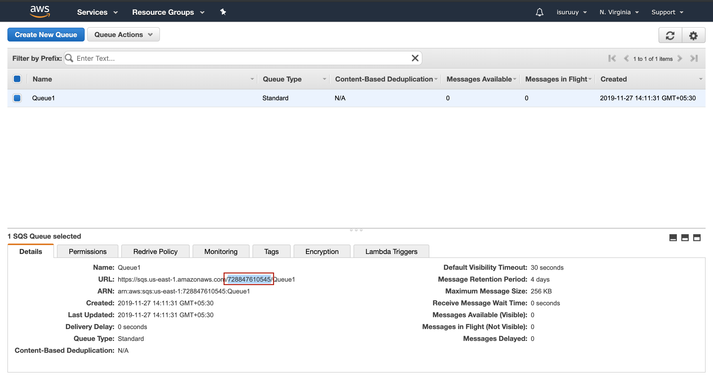

# Alert Notification Using AmazonSQS

Ballerina is an open-source programming language that empowers developers to integrate their system easily with the 
support of connectors. In this guide, we are mainly focusing on how to use Amazon SQS Connector to notify alerts. 
You can find other integration modules from the [wso2-ballerina](https://github.com/wso2-ballerina) GitHub repository.

<!-- INCLUDE_MD: ../../../../../tutorial-prerequisites.md -->

## What you'll build

The following diagram illustrates the scenario:


Let's consider a scenario where a fire alarm sends fire alerts to an Amazon SQS queue. As message duplication is not an issue, an Amazon SQS Standard Queue is used as the queue. A fire alarm listener is polling the messages in the SQS queue. When fire alerts are available, it will consume the messages from the queue and remove the messages from the queue. Consumed messages are showed in the console to the User.

Here, the fire alarm is sending fire alerts periodically from a Ballerina worker where listener polls in another worker. Both sent messages and received messages are printed in the console.

As there can be multiple alert messages available in the queue, the listener is configured to consume more than one message at a time.

- [Amazon SQS Account](https://aws.amazon.com/sqs/)

## Implementation

<!-- INCLUDE_MD: ../../../../../create-project.md -->

The project structure should look like below.

```
  notifying-fire-alarm-using-sqs
  ├── Ballerina.toml
  └── src
      └── alert_notification_using_amazonsqs
          ├── Module.md
          ├── create_notification_queue.bal
          ├── notify_fire.bal
          ├── listen_to_fire_alarm.bal
          └── main.bal
```

Now that you have created the project structure, the next step is to develop the integration scenario.

#### Set up credentials for Amazon SQS

Create a new access key, which includes a new secret access key. - To create a new secret access key for your root account, use the [security credentials](https://console.aws.amazon.com/iam/home?#security_credential) page. Expand the Access Keys section, and then click Create New Root Key.

To create a new secret access key for an IAM user, open the [IAM console](https://console.aws.amazon.com/iam/home?region=us-east-1#/home). Click Users in the Details pane, click the appropriate IAM user, and then click Create Access Key on the Security Credentials tab.

Download the newly created credentials, when prompted to do so in the key creation wizard.

#### Add project configurations file

Add the project configuration file by creating a ballerina.conf file under the root path of the project structure. This file should have following configurations. Add the obtained Amazon SQS configurations to the file.

```
ACCESS_KEY_ID="<Amazon SQS key ID>"
SECRET_ACCESS_KEY="<Amazon SQS secret key>"
REGION="<Amazon SQS region>"
ACCOUNT_NUMBER="<Amazon Account number>"
```

When a queue is created you can find the `ACCOUNT_NUMBER` under **Details** tab in the SQS Management Console as shown below.



#### Write the integration.

Take a look at the code samples below to understand how to implement the integration scenario.

The following code creates a new queue in Amazon SQS with the configuration provided in a file. In order to create a queue initialize the `amazonsqs:Client` with configuration parameters and invoke the `createQueue` method of it.

**create_notification_queue.bal**
<!-- INCLUDE_CODE: src/alert_notification_using_amazonsqs/create_notification_queue.bal -->

The following code generates fire alert notifications periodically and these are sent to the above created SQS queue. Instead of the `while` loop added, you can add some custom logic to trigger fire alarm. Create a client as described in step 1 and invoke `sendMessage` method to send alert message to the SQS queue.

**notify_fire.bal**
<!-- INCLUDE_CODE: src/alert_notification_using_amazonsqs/notify_fire.bal -->

The following code listens to the SQS queue and if there are any notifications, it would receive from the queue and delete the existing messages in the queue. `sleep` method in the `while` loop can be called according to the polling interval. Then create the client as described in step 1 and invoke `receiveMessage` method. Depending on the `MaxNumberOfMessages` parameter set in the `attributes` array, maximum number of messages received per API invocation will be restricted. Each message can be accessed with `receiptHandle` value in the response. Once the message is read it can be deleted by invoking the `deleteMessage` method.

**listen_to_fire_alarm.bal**
<!-- INCLUDE_CODE: src/alert_notification_using_amazonsqs/listen_to_fire_alarm.bal -->

In the following code, the `main` method would implement the workers related to creating a queue, sending a message to the queue, and consuming and receiving/deleting messages from the queue. There the workers can be replaced with the relevant code. `queueCreator` code should be called once to setup the queue. Code in the `fireNotifier` can be called from the fire alarm triggering side while `fireListener` should reside in the alarm polling/listening code.

**main.bal**
<!-- INCLUDE_CODE: src/alert_notification_using_amazonsqs/main.bal -->

## Testing

First let’s build the module. Navigate to the project root directory and execute the following command.

```bash
  $ ballerina build alert_notification_using_amazonsqs
```

This creates the executables. Now run the `guide.jar` file created in the above step.

```bash
  $ java -jar target/bin/alert_notification_using_amazonsqs.jar
```

You see the SQS queue creation, sending fire alerts to the queue, consuming process of queues and subsequent deletion process on console.

<!-- INCLUDE_MD: ../../../../../tutorial-get-the-code.md -->

<!-- INCLUDE_MD: ../../../../../next-steps.md -->