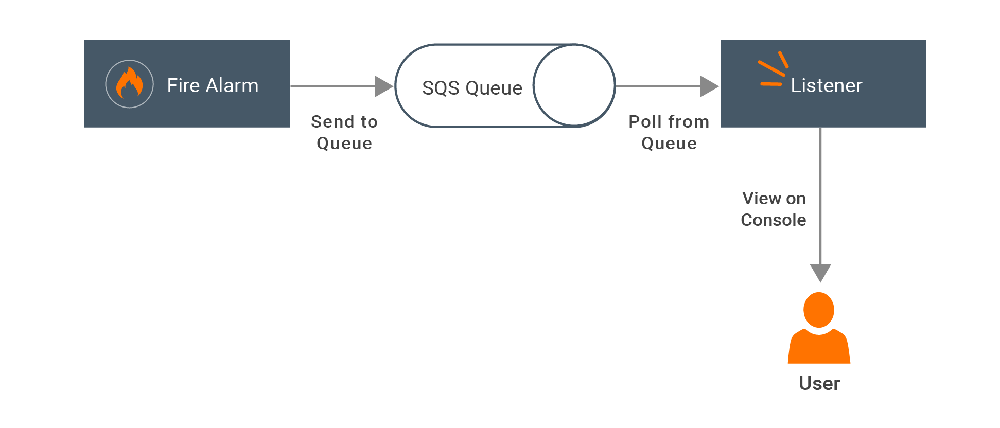

# Backup CSV Files Using Google Spreadsheets

Ballerina is an open-source programming language that empowers developers to integrate their system easily with the 
support of connectors. In this guide, we are mainly focusing on how to use Google Spreadsheets Connector to backup CSV (Comma Separated Value) files in Google Spreadsheets. 
You can find other integration modules from the [wso2-ballerina](https://github.com/wso2-ballerina) GitHub repository.


## What you'll build

The following diagram illustrates the scenario:



Let's consider a scenario where a CSV file is uploaded to a newly created Google Spreadsheet. A new sheet is created in the spreadsheet with the current date as the sheet name. CSV content is added to the new sheet.

Then the new sheet is read and the content is displayed in the console to the user.

<!-- INCLUDE_MD: ../../../../../tutorial-prerequisites.md -->

- [Google Spreadsheet Account](https://docs.wso2.com/display/IntegrationCloud/Get+Credentials+for+Google+Spreadsheet)

<!-- INCLUDE_MD: ../../../../../tutorial-get-the-code.md -->

## Implementation

1. Create a new project.

    ```bash
    $ ballerina new backup-csv-files-using-googlespreadsheets
    ```

2. Create a module.

    ```bash
    $ ballerina add backup_csv_files
    ```

To implement the scenario in this guide, you can use the following package structure:

```
  backup-csv-files-using-googlespreadsheets
  ├── Ballerina.toml
  └── src
      └── backup_csv_files
          ├── Module.md
          └── uploader.bal
```

Now that you have created the project structure, the next step is to develop the integration scenario.

#### Write the integration.

Take a look at the code samples below to understand how to implement the integration scenario.

The following code creates a new queue in Amazon SQS with the configuration provided in a file.

**create_notification_queue.bal**
<!-- INCLUDE_CODE: src/alert_notification_using_amazonsqs/create_notification_queue.bal -->

The following code generates fire alert notifications periodically and these are sent to the above created SQS queue.

**notify_fire.bal**
<!-- INCLUDE_CODE: src/alert_notification_using_amazonsqs/notify_fire.bal -->

The following code listens to the SQS queue and if there are any notifications, it would receive from the queue and delete the existing messages in the queue.

**listen_to_fire_alarm.bal**
<!-- INCLUDE_CODE: src/alert_notification_using_amazonsqs/listen_to_fire_alarm.bal -->

In the following code, the `main` method would implement the workers related to creating a queue, sending a message to the queue, and consuming and receiving/deleting messages from the queue.

**main.bal**
<!-- INCLUDE_CODE: src/alert_notification_using_amazonsqs/main.bal -->

#### Developing the scenario

1. Configure parameters in `create_notification_queue.bal`, which will create a new queue. In order to create a queue initialize the `amazonsqs:Client` with configuration parameters and invoke the `createQueue` method of it. `ACCESS_KEY_ID` and `SECRET_ACCESS_KEY` can be obtained from the Amazon account you have created. When a queue is created you can find the `ACCOUNT_NUMBER` of the SQS account.

2. Configure/develop `notify_fire.bal`, which will send periodic fire alerts to the created SQS queue. Instead of the `while` loop added, you can add some custom logic to trigger fire alarm. Create a client as described in step 1 and invoke `sendMessage` method to send alert message to the SQS queue.

3. Configure/develop `listen_to_fire_alarm.bal`, which will listen to the above created queue with polling. `sleep` method in the `while` loop can be called according to the polling interval. Then create the client as described in step 1 and invoke `receiveMessage` method. Depending on the `MaxNumberOfMessages` parameter set in the `attributes` array, maximum number of messages received per API invocation will be restricted. Each message can be accessed with `receiptHandle` value in the response. Once the message is read it can be deleted by invoking the `deleteMessage` method.

4. Configure/develop `main.bal`, which will implement the different workers for each of the above cases and run the system. There the workers can be replaced with the relevant code. `queueCreator` code should be called once to setup the queue. Code in the `fireNotifier` can be called from the fire alarm triggering side while `fireListener` should reside in the alarm polling/listening code.

## Testing

First let’s build the module. Navigate to the project root directory and execute the following command.

```bash
  $ ballerina build alert_notification_using_amazonsqs
```

This creates the executables. Now run the `guide.jar` file created in the above step.

```bash
  $ java -jar target/bin/alert_notification_using_amazonsqs.jar
```

You see the SQS queue creation, sending fire alerts to the queue, consuming process of queues and subsequent deletion process on console.
