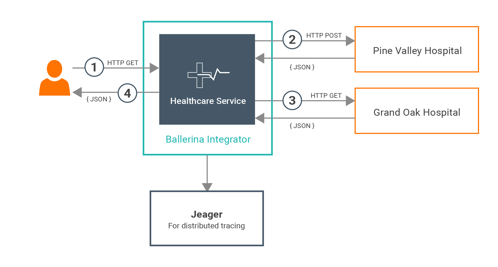

# Distributed Tracing with Jaeger

Tracing provides information regarding the roundtrip of a service invocation based on the concept of spans, which are structured in a hierarchy based on the cause and effect concept. Tracers propagate across several services that can be deployed in several nodes, depicting a high-level view of interconnections among services as well, hence coining the term distributed tracing. Jaeger is the default tracer supported by Ballerina.

To understand how you can do distributed tracing for Ballerina services, let’s consider the service you created in the Quick Start Guide.



There are many possible ways to deploy Jaeger and you can find more information on this [link](https://www.jaegertracing.io/docs/deployment/). Here we focus on all in one deployment with Docker.

**Step 1:** Install Jaeger via Docker and start the Docker container by executing below command.

```bash
$ docker run -d -p5775:5775/udp -p6831:6831/udp -p6832:6832/udp -p5778:5778 -p16686:16686 -p14268:14268 jaegertracing/all-in-one:latest
```

**Step 2:** Go to <http://localhost:16686> and load the web UI of the Jaeger to make sure it is functioning properly.

The below image is the sample tracing information you can see from Jaeger.


